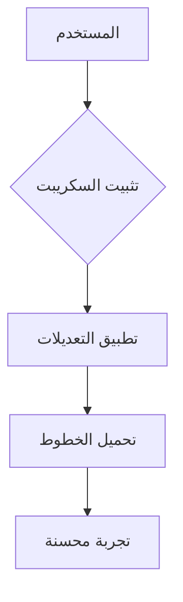

<h1 align="center">دعم اللغة العربية لـ Deepseek Chat</h1>

<div align="center">
  
  <br>
  <sub>تم تطوير السكريبت لدعم تجربة المستخدم العربي</sub>
</div>

سكريبت مخصص لمستخدمي اللغة العربية لتحسين تجربة الدردشة على [Deepseek Chat](https://chat.deepseek.com/) مع دعم كامل للكتابة من اليمين لليسار (RTL) وتحسينات مرئية مُتقدمة.

✅**مشروع مفتوح المصدر**✅

✨**لا إعلانات، لا مخاطر، فقط ثقة ومحبة حقيقية**✨

بإمكانك نسخ المشروع والإستفادة منه كما تشاء *fork*❤️


## ✨ المميزات الرئيسية
- **🎯 توجيه تلقائي** للعناصر والنصوص (RTL Support)
- **📖 خطوط عربية واضحة** مع دعم التشكيل والمسافات البينية
- **⚙️ توافق تام** مع واجهة الموقع الأصلية
- **📱 تجربة مُحسنة** على جميع الأجهزة
- **💻 الحفاظ على تنسيق الأكواد البرمجية**

## 📥 طريقة التثبيت
1. **ثبت Tampermonkey Extension**:  
   [](https://chrome.google.com/webstore/detail/tampermonkey/dhdgffkkebhmkfjojejmpbldmpobfkfo)  
   [](https://addons.mozilla.org/firefox/addon/tampermonkey/)

2. **ثبت السكريبت**:  
   [](https://greasyfork.org/ar/scripts/533637-deepseek-arabic-support)

3. **Refresh Page** on [Deepseek Chat](https://chat.deepseek.com/)

## 📸 لقطات الشاشة
قبل التثبيت | بعد التثبيت
---|---
 | 

## ⚙️ إعدادات مخصصة
```css
/* تغيير حجم الخط */
body { 
  font-size: 18px !important;
}

/* تغيير لون النصوص */
.message-content { 
  color: #2d3748 !important;
}
```

## 📊 التفاصيل الفنية
| Category        | Details                          |
|-----------------|----------------------------------|
| الإصدار         |  |
| التثبيتات]        |  |
| التوافق   | Tampermonkey, Violentmonkey      |
| اخر تحديث    |  |

## 🌍 Supported Platforms


## 📜 الترخيص
مرخص تحت [GNU GPL v3](https://www.gnu.org/licenses/gpl-3.0.ar.html)  
[](https://www.gnu.org/licenses/gpl-3.0)

---

## ❓ الأسئلة الشائعة
**Q: هل يعمل على الهواتف الذكية؟**  
ج: نعم، يدعم جميع الأجهزة الحديثة.

**Q: كيف أبلغ عن مشكلة؟**  
ج: عبر [صفحة المشاكل](https://github.com/nvkq/deepseek-arab/issues)

---

## 💡 الدعم
- ⭐ قم بتقييم المشروع على [GitHub](https://github.com/nvkq/deepseek-arab)
- 🐞 الإبلاغ عن الأخطاء [هنا](https://github.com/nvkq/deepseek-arab/issues)
- ✨ اقتراح تحسينات [هنا](https://github.com/nvkq/deepseek-arab/discussions)


---

## 🔧 البنية التقنية


## 🛠️ Roadmap
- [x] RTL Support
- [x] Font Optimization
- [ ] Dynamic Settings Panel
- [ ] Dark Mode Support
```
